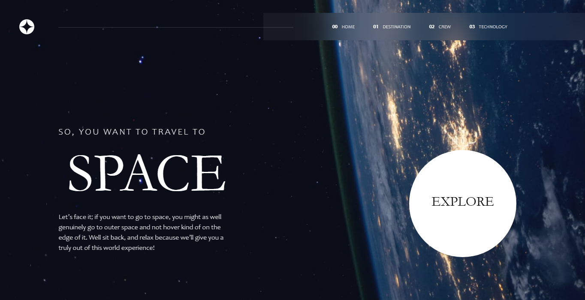

# Frontend Mentor - Space tourism website solution

This is a solution to the [Space tourism website challenge on Frontend Mentor](https://www.frontendmentor.io/challenges/space-tourism-multipage-website-gRWj1URZ3). Frontend Mentor challenges help you improve your coding skills by building realistic projects.

## Table of contents

- [Overview](#overview)
  - [The challenge](#the-challenge)
  - [Screenshot](#screenshot)
  - [Links](#links)
- [My process](#my-process)
  - [Built with](#built-with)
  - [What I learned](#what-i-learned)
  - [Continued development](#continued-development)

## Overview
Dr Angela Yu of London App Brewery recommended this challenge after completing a basic course in html and css. Finding it quite challenging but exciting too.

### The challenge

Users should be able to:

- View the optimal layout for each of the website's pages depending on their device's screen size
- See hover states for all interactive elements on the page
- View each page and be able to toggle between the tabs to see new information

### Screenshot

### Links

- Solution URL: [Add solution URL here](https://christone007.github.io/space-tourism-website/)

## My process
I have just started. Struggled a lot to structure my html and css code. Glad i was able to get the desktop layout for the meantime. Still working on this project...

### Built with

- Semantic HTML5 markup
- CSS custom properties

### What I learned
learned how to use the css backdrop-filter to create glassmorphic effects.

### Continued development

I am just starting out. I would create all other pages and make the website fully responsive with time.
